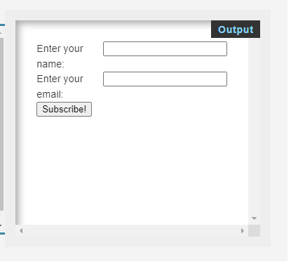

## HTML

HTML (HyperText Markup Language) is used to give content to a web page and instructs web browsers on how to structure that content.
**Tags** are used to structure the contents of a html document. 

```html
<html>
  <head>
    <! –– styles,scripts,metadata are placed here. -->
  </head>
  <body>
      <! –– insert content here -->
  </body>
</html>
```

### Element Content

The content of an HTML element is the information between the opening and closing tags of an element.

```html
<p>Mahbub's an awesome teacher</p>
```

### HTML Structure

HTML is organized into a family tree structure. HTML elements can have parents, grandparents, siblings, children, grandchildren, etc.

```html
<body>
  <div>
    <h1>Header 1</h1>
    <h2>Tags can be inside another tags</h2>
  </div>
</body>
```
### Closing Tag

An HTML closing tag is used to denote the end of an HTML element. The syntax for a closing tag is a left angle bracket 
`
<
` 
followed by a forward slash 
`
/
`
then the element name and a right angle bracket to close >.

```html
<body>
 ....
</body>
```
### Attribute Name and Values

HTML attributes consist of a name and a value using the following syntax: name="value" and can be added to the opening tag of an HTML element to configure or change the behavior of the element.

```html
<elementName name="value"></elementName>
```

## Tags Examples

### Heading Elements

Below are some heading examples in code followed by their output.

```html
<h1>heading 1</h1>
<h2>heading 2</h2>
<h3>heading 3</h3>
<h4>heading 4</h4>
<h5>heading 5</h5>
<h6>heading 6</h6>
```
# Output:

# heading 1

## heading 2

### heading 3

#### heading 4

##### heading 5

###### heading 6


## Div Element

The `<div>` element is used as a container that divides an HTML document into sections and is short for `division`. `<div>` elements can contain flow content such as headings, paragraphs, links, images, etc.

```html
<div>
  <p>Web and Internet fundamentals</p>
  <span>Fall Intake</span>
</div>
<div>
  <p>Internet of things</p>
  <a href="https://bowvalleycollege.ca/"></a>
</div>

```

## Emphasis

Emphasis, aka italics, with _asterisks_ or _underscores_.

Strong emphasis, aka bold, with **asterisks** or **underscores**.

Combined emphasis with **asterisks and _underscores_**.

Strikethrough uses two tildes. ~~Scratch this.~~


```html
<div>
  <strong>Strong emphasis, aka bold</strong>
  <b>BOLD</b>
</div>
<div>
  <em>Emphasis, aka italics</em>
  <i>Emphasis, aka italics</i>
</div>
<div>
  <u>underlined</u>
  <strike>Strikethrough</strike>
  <del>Strikethrough</del>
  <s>Strikethrough</s>
</div>
```


## Lists

1. First ordered list item
2. Another item
3. Actual numbers don't matter, just that it's a number

```html
<ol>
  <li> First ordered list item</li>
  <li> Another item</li>
  <li> Actual numbers don't matter, just that it's a number</li>
</ol>
```

- Unordered list

* minuses

- pluses


```html
<ul>
  <li>Unordered list</li>
  <li>minuses</li>
  <li>pluses</li>
</ul>
```

## Links

[I'm an inline-style link](https://www.google.com)
```html
<a href="https://www.google.com">I'm an inline-style link</a>
```
[I'm an inline-style link with title](https://www.google.com "Google's Homepage")

```html
<a href="https://www.google.com" title="Google's Homepage">I'm an inline-style link with title</a>
```

## Images

<div className="">
  
</div>

Bow Valley College is a public, board-governed college operating as a comprehensive community institution under the Post-Secondary Learning Act of Alberta. The branch campuses are: Airdrie, Banff, Canmore, Cochrane, High River, Okoktoks, and Strathmore

```html
<div>
  
  <p>Bow Valley College is a public, board-governed college operating as a comprehensive community institution under the Post-Secondary Learning Act of Alberta. The branch campuses are: Airdrie, Banff, Canmore, Cochrane, High River, Okoktoks, and Strathmore</p>
</div>
```

## Blockquotes

> Time is Gold.

```html
<blockquote>
  Time is Gold
</blockquote>
```
## Horizontal Rule

represents a thematic break between paragraph-level elements: for example, a change of scene in a story, or a shift of topic within a section.

---

```html
<hr>
```

## Table

represents tabular data — that is, information presented in a two-dimensional table comprised of rows and columns of cells containing data.

<table>
    <thead>
        <tr>
            <th colspan="2">The table header</th>
        </tr>
    </thead>
    <tbody>
        <tr>
            <td>The table body</td>
            <td>with two columns</td>
        </tr>
    </tbody>
</table>

```html
<table> 
    <thead> <!-- table header -->
        <tr> <!-- table row -->
            <th colspan="2">The table header</th> <!-- table heading -->
        </tr>
    </thead>
    <tbody> <!-- table body -->
        <tr> 
            <td>The table body</td> <!-- table data -->
            <td>with two columns</td>
        </tr>
    </tbody>
</table>
```

## Forms

represents a document section containing interactive controls for submitting information.

<div className="Image__Small">
  
</div>

```html
<form action="" method="get" class="form-example">
  <div class="form-example">
    <label for="name">Enter your name: </label>
    <input type="text" name="name" id="name" required> <!-- input box -->
  </div>
  <div class="form-example">
    <label for="email">Enter your email: </label>
    <input type="email" name="email" id="email" required>
  </div>
  <div class="form-example">
    <input type="submit" value="Subscribe!"> <!-- submit button -->
  </div>
</form>
```

### Buttons

represents a clickable button, used to submit forms or anywhere in a document for accessible, standard button functionality.

<button type="button">
    this is a button
</button>

```html
<button type="button">
    this is a button
</button>
```

```html
<input type="submit">
    this is a button
</input>
```